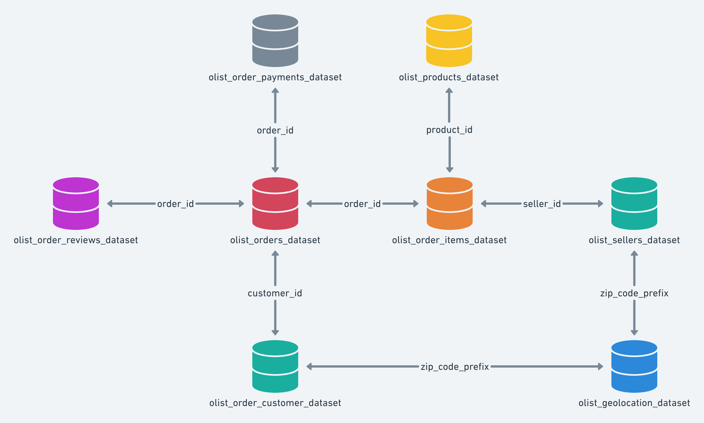

# NorthStar Commerce Analytics

NorthStar is an end-to-end e-commerce analytics case study built from the Olist Brazilian E-Commerce Dataset. It turns raw order data into a small PostgreSQL reporting layer, business analysis, and an executive dashboard.

## Project Goal

Analyze e-commerce performance and identify:

- Top merchandise-value categories
- Top customer segments
- Geographic merchandise-value distribution
- Monthly merchandise-value trends

## Tools

- PostgreSQL
- SQL
- Tableau
- VS Code

## Dataset

Olist Brazilian E-Commerce Dataset

## Data Model



## Cleaning Process

- Checked for duplicates
- Checked NULL values
- Validated primary keys

## Business Questions

1. Which states generated the most merchandise value?
2. Which product categories generated the most merchandise value?
3. Who are the highest-value customers?
4. What is monthly merchandise-value growth?
5. What categories have highest average order value?

## Dashboard

The executive dashboard is a lightweight browser dashboard built from the processed reporting views. It covers:

- merchandise value, order volume, average order value, and delivery reliability
- monthly sales rhythm and peak-month context
- category mix by units or merchandise value
- state contribution to merchandise value
- monthly delivery performance

Open [dashboard/index.html](dashboard/index.html) through a local server from the project root:

```bash
python3 -m http.server 4173
```

Then visit `http://localhost:4173/dashboard/`.

## Key Findings

- Merchandise value totals R$13.59M across 99,441 orders, with an average merchandise value of R$137.75 per order.
- November 2017 is the strongest month at R$1.01M in merchandise value.
- São Paulo contributes R$5.20M, or 38.3% of merchandise value, well ahead of Rio de Janeiro and Minas Gerais.
- Health and beauty leads category value at R$1.26M, followed by watches and gifts at R$1.21M.
- Repeat customers represent only 3.12% of actual customers, making retention the clearest commercial opportunity.
- 91.89% of eligible delivered orders arrived on time, but state performance varies materially.

## Project Structure

- `data/raw/`: source CSV files
- `data/processed/`: exports from the reporting views
- `sql/`: table creation, import, validation, analysis, and view scripts
- `docs/`: query outputs, data-quality findings, and project notes
- `dashboard/`: browser-based executive dashboard
